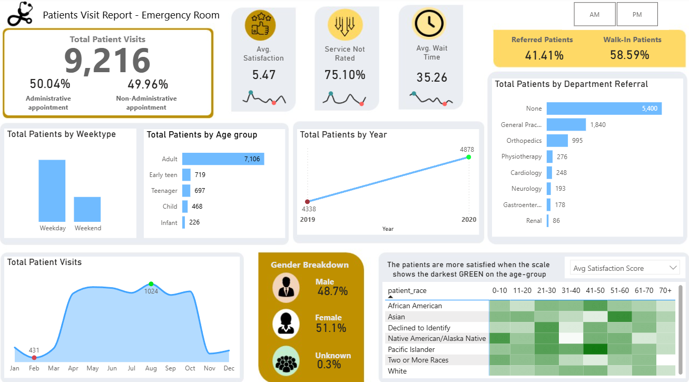

# Healthcare-Dashboard_Power_BI

## Introduction
This project focuses on building a **Power BI dashboard** for analyzing patient wait times in the Emergency Room (ER). The dashboard provides interactive insights into patient demographics, satisfaction scores, referral departments, and wait times.  
By integrating data cleaning, DAX measures, and custom visual design, this project demonstrates how healthcare data can be transformed into meaningful and actionable insights.  

---

## Tech Stack
- **Power BI Desktop** – data modeling, DAX calculations, and dashboard creation  
- **Power Query Editor** – data transformation (date/time parsing, column merging, quality checks)  
- **DAX (Data Analysis Expressions)** – custom measures and KPIs  
- **Microsoft Excel / CSV** – data source (9,217 rows sample dataset)  

---

## Motivation
I wanted to showcase my **learnings and expertise in Power BI** by creating a professional and interactive dashboard that not only looks visually appealing with a custom design but also translates data into clear, actionable insights. This project highlights my ability to use DAX measures, parameters, and slicers effectively while demonstrating the end-to-end BI workflow from data preparation and modeling to visualization and storytelling.  

---

## Project Overview
This project uses a dataset of **9,217 ER patient records** containing demographics, satisfaction scores, referral departments, and wait times. Data was first cleaned in **Power Query** by checking column quality, splitting date/time, and merging name fields.  

In **Power BI**, I created a dedicated **Calculations table** with DAX measures to compute total patients, admin ratios, average satisfaction, average wait times, and missing ratings. Additional measures aggregated visits by month, year, department, gender, and race, with highlights for peak and low periods. Patients were grouped into age buckets to allow comparison of wait times and satisfaction across demographics.  

The final dashboard features **interactive visuals** showing average wait times, patient satisfaction, demographic breakdowns, monthly/yearly trends, and department referrals. A **custom background** was added to give the dashboard a clean and professional look.  
A final look of the dashboard is attached below.  

  

---

## Conclusion
This project demonstrates how **Power BI** can transform data into actionable insights by analyzing patient wait times, satisfaction, and referral trends. Such analysis helps hospitals improve patient experience, identify bottlenecks in workflow, and optimize departmental performance. Beyond healthcare, the same approach can be applied across industries where wait times, customer satisfaction, and operational efficiency play a critical role in driving outcomes.  
